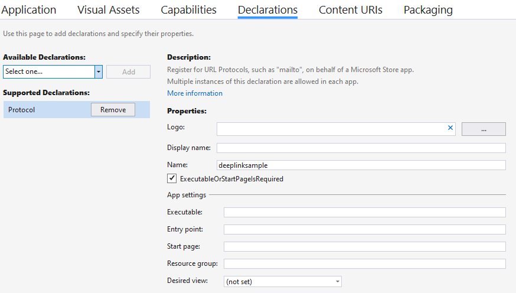

# Microsoft Store Sample: DeepLinkSample

Deep links are a way to navigate to a specific location in an app. Deep links are commonly used to navigate to special offers during marketing campaigns. 
Deep links can be implemented with an app protocol association and app protocol handler. The offer can be presented to the user using a Partner Center engagement notification. Here are the docs: <a href='https://docs.microsoft.com/en-us/windows/uwp/launch-resume/handle-uri-activation'>Handle URI activation - UWP applications | Microsoft Docs</a>

1) Update the manifest to associate a protocol with the application. For example, in Visual Studio:<BR>
<BR>


The manifest should have an entry as follows:
```xml
<uap:Extension Category="windows.protocol">
<uap:Protocol Name="deeplinksample"/>
</uap:Extension>
```


2) With the defined protocol, the app can be launched with parameters. In this case promo is set to winterwonderland and the app will navigate to the winter campaign page. 
For example:
```deeplinksample:?promo=winterwonderland```

3) In the app, use the Windows Community Toolkit to modify your OnActivated handler to process the query string that tells the app where to navigate. See here: <a href='https://docs.microsoft.com/en-us/windows/communitytoolkit/helpers/deeplinkparsers'>DeepLinkParser - Windows Community Toolkit | Microsoft Docs</a>:

```C#
if (args.Kind == ActivationKind.Protocol)
{
    ProtocolActivatedEventArgs eventArgs = args as ProtocolActivatedEventArgs;
    var parser = DeepLinkParser.Create(args);
    if (parser.ContainsKey("promo"))
    {
        if (parser["promo"] == "winterwonderland")
        {
            navigationDestination = typeof(PromoPage);
            rootFrame.Navigate(navigationDestination);
        }
    }
}
```

4) In Partner Center, compose a blank Toast Engagement notification with the launch parameter set with the protocol uri:
```deeplinksample:?promo=winterwonderland``` Documenation here: 
<a href='https://docs.microsoft.com/en-us/windows/uwp/publish/send-push-notifications-to-your-apps-customers'>Send targeted push notifications to your app's customers - UWP applications | Microsoft Docs</a>

### In App Purchase SKU for Promotion:
1) Create a new subscription addon with 1 month free trial in Partner Center.
2) Update app to process new addon: Check if user has license of addon, enable features in app related to addon.
1.	Call GetAppLicenseAsync() to get the storeAppLicense info;
2.	Call  storeAppLicense.AddOnLicenses() to get storelicense info of all available addon;
3.	Call IsActive() function of addon storelicense to check if it is active or not;
4.	If it is an active storelicense, then the info of this addon is available Such as skuStoreID, expirationDate.
